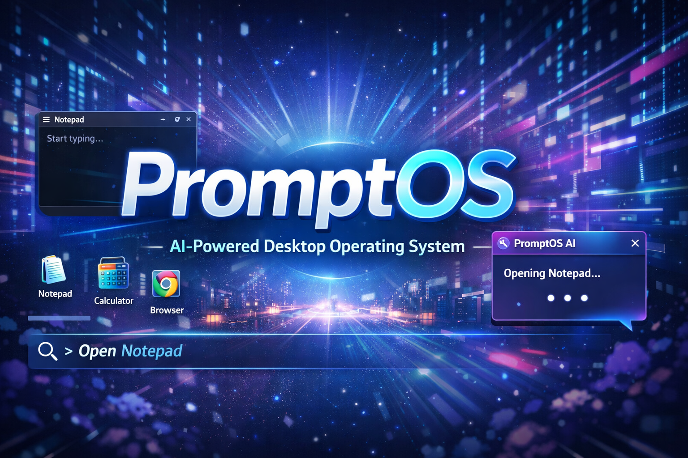

# PromptOS 🧠💻

**PromptOS** is a futuristic **AI-powered Web Operating System** that runs directly in the browser.
Instead of clicking apps traditionally, users can **control the system using natural language commands** in a prompt interface.

PromptOS combines the feel of a **desktop OS** with the simplicity of a **command-based AI assistant**.

---

# ✨ Features

## 🖥 Desktop Environment

* Modern web-based desktop UI
* Window-based application system
* Draggable application windows
* Maximize / Close window controls
* Desktop icons with click support

## 🔐 Lock Screen

* Animated lock screen
* Dynamic time & date display
* Click to unlock interaction
* Custom wallpaper support

## ⌨ Prompt Command Interface

Users can control the OS using text commands such as:

```
open notepad
launch notes
run calculator
start browser
```

PromptOS intelligently understands commands even with **small spelling mistakes**.

Example:

```
ope notpad
opn note
```

PromptOS will still open **Notepad**.

## 🤖 AI Response System

PromptOS includes a **built-in AI assistant interface**.

When a command is executed, the AI responds with a system message:

```
Opening Notepad...
Launching workspace...
Application ready.
```

The response appears in a floating **AI response card**.

## 🪟 Window Manager

PromptOS supports:

* Multiple open apps
* Z-index window focus
* Window dragging
* Window maximize
* Window closing

## 📱 Responsive UI

Designed using modern CSS for responsive layouts and smooth animations.

---

# 📦 Built With

* **HTML5**
* **CSS3**
* **Vanilla JavaScript**
* Browser DOM APIs

No frameworks required.

---

# 🧩 Application System

Apps are registered inside a **JavaScript app registry**.

Example:

```javascript
const apps = {
  notepad: {
    title: "Notepad",
    icon: "📝",
    width: 420,
    height: 300,
    content: `<textarea placeholder="Start typing..."></textarea>`
  }
};
```

PromptOS automatically:

* Generates desktop icons
* Handles app launching
* Creates windows dynamically

---

# 💬 Prompt Command System

Commands are parsed and matched against installed apps.

Example flow:

1. User types a command
2. Command is normalized
3. PromptOS searches installed apps
4. App launches automatically

---

# 📂 Project Structure

```
PromptOS
│
├── index.html
├── style.css
├── script.js
│
├── images
│   ├── wallpaper1.png
│   └── lockscreen.png
│
└── README.md
```

---

# 🚀 Future Features

Planned upgrades for PromptOS:

* AI assistant powered by LLM
* Voice commands
* File explorer
* Terminal emulator
* Web browser app
* Plugin system
* Custom themes
* App marketplace

---

# 🎯 Vision

PromptOS explores the idea of a **next-generation operating system** where users interact with their computer using **natural language instead of buttons**.

It aims to simulate how **AI-native operating systems** might work in the future.
 
---

# 📜 License

This project is open-source and available under the **MIT License**.

---

# ⭐ Support

If you like this project, consider giving it a ⭐ on GitHub!
